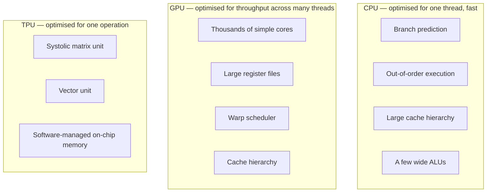
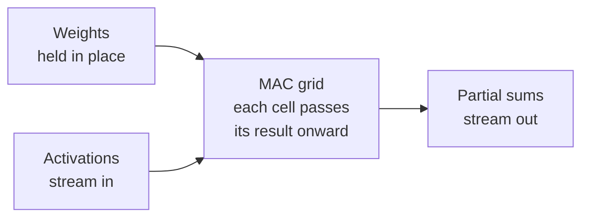

# Why TPUs exist

## The forcing function

Around 2013 Google worked through a projection: if every Android user ran
voice search for three minutes a day, serving it on the existing fleet would
require roughly doubling the datacenter footprint. Building a chip turned out
to be cheaper than building the buildings.

That framing is worth keeping. A TPU is not a research artifact — it is a
capital expenditure argument that happened to be made in silicon.

## What the workload actually is

Nearly all of the arithmetic in a neural network is dense matrix
multiplication. A transformer layer is a handful of large matmuls plus
comparatively cheap elementwise work. Training runs the same shapes billions
of times.

This is an unusually narrow workload, and narrow workloads are exactly what
general-purpose processors handle badly.

## What general-purpose silicon spends its area on

A CPU spends most of its transistor budget on *deciding what to do next*:
predicting branches, reordering instructions, keeping caches coherent. For a
matrix multiply, where the instruction stream is known in advance and perfectly
regular, all of that machinery is overhead.

A GPU is dramatically better — thousands of simple cores executing the same
instruction across different data is a good match. But it remains general
purpose. Register files, caches, and scheduling hardware still consume area and
power on every operation.

## The systolic array

A TPU's matrix unit is a two-dimensional grid of multiply-accumulate cells.
Operands are pushed in at the edges and flow through the grid; each cell
multiplies, accumulates, and hands its result to its neighbour.

The consequence: after operands enter the array, producing each partial
product costs no register read, no cache lookup, and no instruction decode.
Data moves directly between adjacent cells.

For the same die area and power budget, this performs far more multiplies than
a general-purpose design. That is the entire trade — flexibility is exchanged
for efficiency on one operation.

## What it gives up

An ASIC only wins on the workload it was designed for.

- Operations that are not dense matmul get comparatively little benefit. They
  run on the vector unit and are usually bandwidth-limited.
- Irregular control flow, dynamic shapes, and sparsity map poorly.
- On-chip memory is largely **software-managed**. There is no cache to rescue
  a poor access pattern — the compiler and kernel author decide what lives in
  fast memory and when. This is why kernel authoring on TPU is explicit about
  tiling in a way that GPU code often is not.

That last point is the one that matters most in practice, and it leads
directly to the next question: if the matrix unit is this fast, why do real
workloads reach only a fraction of peak?

The answer is not the matrix unit. It is everything around it →
**[the roofline model](roofline.md)**.
