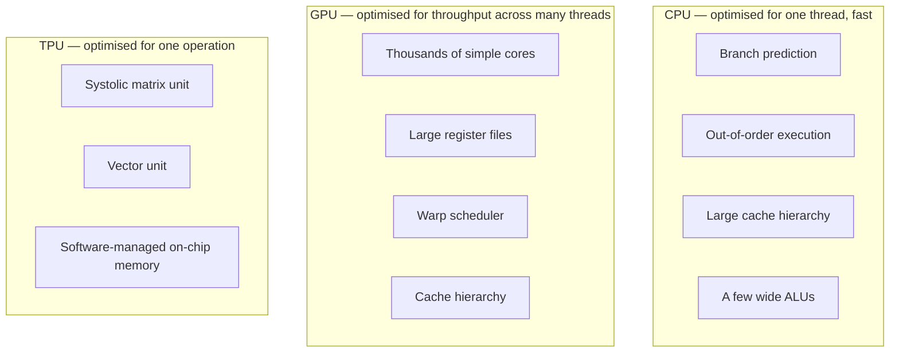
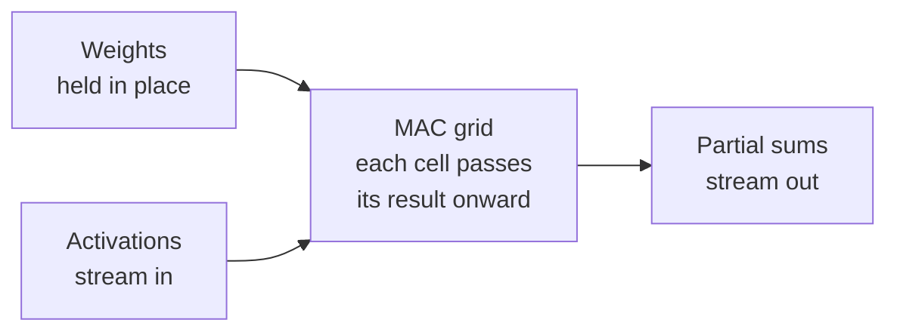

# Why TPUs exist

## Origin

Around 2013 Google estimated that if every Android user ran voice search for
three minutes a day, serving the load on existing hardware would require
approximately doubling the datacenter footprint. Designing a dedicated chip
was less expensive than the alternative. The TPU was a capital cost decision
before it was a technical one.

## The workload

Nearly all arithmetic in a neural network is dense matrix multiplication. A
transformer layer consists of a small number of large matrix multiplications
plus comparatively inexpensive elementwise operations, and training repeats
the same shapes billions of times.

The workload is therefore narrow, and general-purpose processors execute
narrow workloads inefficiently.

## What general-purpose silicon spends its area on

Most of a CPU's transistor budget is spent on control: branch prediction,
instruction reordering, and cache coherence. For matrix multiplication, where
the instruction stream is known in advance and entirely regular, that machinery
contributes nothing.

A GPU is substantially better suited. Thousands of simple cores executing one
instruction across different data matches the workload closely. It remains
general purpose, however, and register files, caches, and scheduling hardware
continue to consume area and power on every operation.

## The systolic array

A TPU's matrix unit is a two-dimensional grid of multiply-accumulate cells.
Operands are pushed in at the edges and flow through the grid; each cell
multiplies, accumulates, and hands its result to its neighbour.

Once operands enter the array, producing each partial product requires no
register read, no cache lookup, and no instruction decode. Data moves directly
between adjacent cells.

For the same die area and power budget this performs considerably more
multiplications than a general-purpose design. The trade is flexibility for
efficiency on a single operation.

## Limitations

An ASIC is efficient only on the workload it was designed for.

- Operations other than dense matrix multiplication benefit comparatively
  little. They execute on the vector unit and are typically bandwidth-limited.
- Irregular control flow, dynamic shapes, and sparsity map poorly onto the
  array.
- On-chip memory is largely **software-managed**. No cache compensates for a
  poor access pattern; the compiler and the kernel author determine what
  resides in fast memory and when. TPU kernels are consequently explicit about
  tiling in a way that GPU code frequently is not.

The third property has the largest practical effect, and it raises the
question that follows: if the matrix unit is this efficient, why do real
workloads reach only a fraction of peak throughput?

The limit is usually not the matrix unit but the memory system around it. See
[the roofline model](roofline.md).
