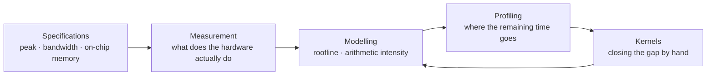

# TPU Performance Lab

A chip's datasheet quotes peak FLOP/s. Large model training commonly sustains
20–50% of it. This site records a systematic attempt to account for the
difference.

Every number here comes from a script in the repository, and every script
records the hardware it ran on alongside its results.

---

## Start here

-   **[Why TPUs exist](concepts/why-tpus.md)**

    What a systolic array buys, and what it gives up, relative to a CPU or GPU.

-   **[The roofline model](concepts/roofline.md)**

    Why the same matrix multiplication is memory-bound at one size and
    compute-bound at another, and how to determine which in advance.

-   **[Experiments](experiments/index.md)**

    Thirteen measurements building toward a hand-written attention kernel.

-   **[Measurement conventions](reference/measurement.md)**

    The three ways naive JAX benchmarks are wrong, and how this repository
    addresses each.

---

## Premise

Compute throughput has outpaced memory bandwidth for several decades. On a
current TPU generation the ratio is in the low hundreds of FLOPs per byte of
HBM traffic. A kernel that does not reuse each fetched byte that many times
leaves the matrix units idle, and additional peak FLOP/s on the next chip
generation does not help it.

Determining which regime a kernel occupies, and moving it, is the subject of
these experiments.

---

## Approach

Each experiment answers one question and is small enough to complete in a
sitting. The sequence is constrained: the arithmetic intensity of a matrix
multiplication cannot be computed without the chip's bandwidth and peak
figures, so the specification table precedes the sweep, and the sweep precedes
any kernel work.

The return edge from kernels to modelling carries most of the information. A
kernel that underperforms its roofline prediction indicates a missing term in
the model, usually an uncounted transfer or a pipeline stage that failed to
overlap.

---

!!! note "Status"

    Early. M0 is written and results are being collected. Pages are published
    as experiments complete rather than held until the set is finished.
