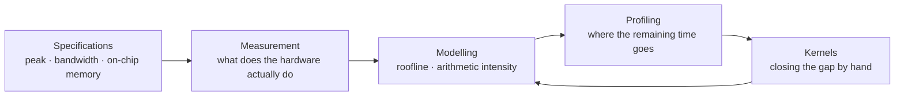

# TPU Performance Lab

A chip's datasheet quotes peak FLOP/s. Large model training commonly runs at
20–50% of it. This site documents a systematic attempt to understand where the
rest goes.

Every number here comes from a script in the repository, and every script
records the hardware it ran on alongside its results.

---

## Start here

-   **[Why TPUs exist](concepts/why-tpus.md)**

    What a systolic array buys, and what it gives up, relative to a CPU or GPU.

-   **[The roofline model](concepts/roofline.md)**

    Why the same matrix multiply is memory-bound at one size and compute-bound
    at another — and how to tell in advance.

-   **[Experiments](experiments/index.md)**

    Thirteen small measurements building toward a hand-written attention
    kernel.

-   **[Measurement conventions](reference/measurement.md)**

    The three ways naive JAX benchmarks lie, and what this repository does
    about each.

---

## The premise

Compute throughput has outpaced memory bandwidth for decades. On a current
TPU generation the ratio sits in the low hundreds of FLOPs per byte of HBM
traffic. A kernel that does not reuse each fetched byte that many times leaves
the matrix units idle, and no amount of additional peak FLOP/s on the next
chip generation will help it.

Determining which regime a kernel is in, and moving it, is the work. That is
what these experiments practise.

---

## Approach

Each experiment answers one question and is small enough to finish. The
sequence matters: the arithmetic intensity of a matrix multiply cannot be
computed without the chip's bandwidth and peak figures, so the specification
table comes before the sweep, and the sweep comes before any kernel work.

The loop back from kernels to modelling is the point. A kernel that
underperforms its roofline prediction means the model is missing a term —
usually a transfer that was not counted, or a pipeline that failed to overlap.

---

!!! note "Status"

    Early. M0 is written; results are being collected. Pages are published as
    experiments complete rather than held back for a finished set.
